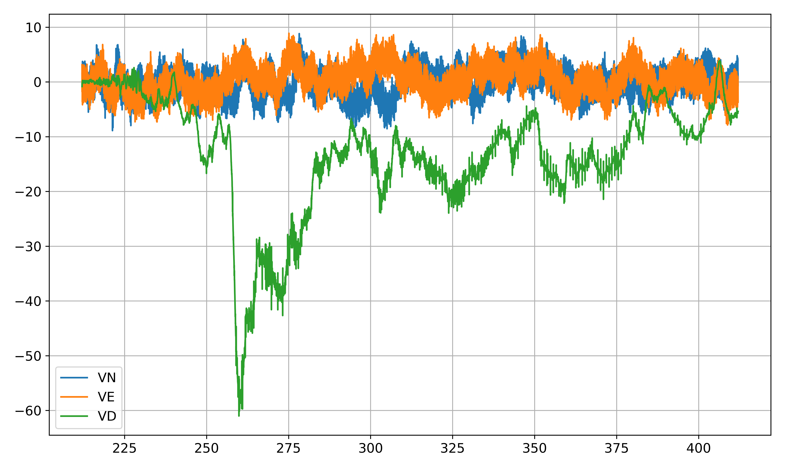
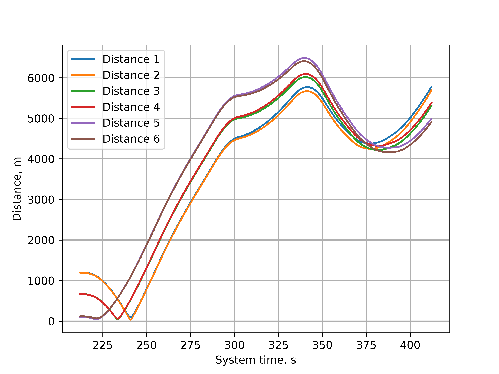
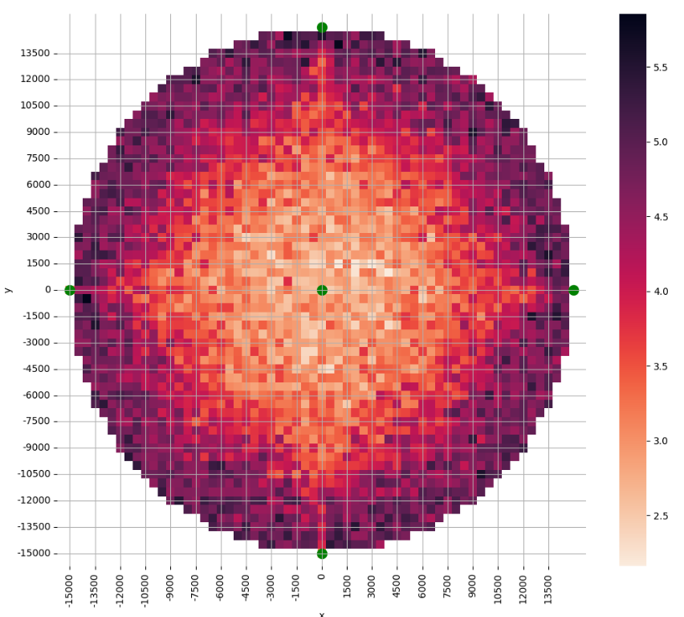
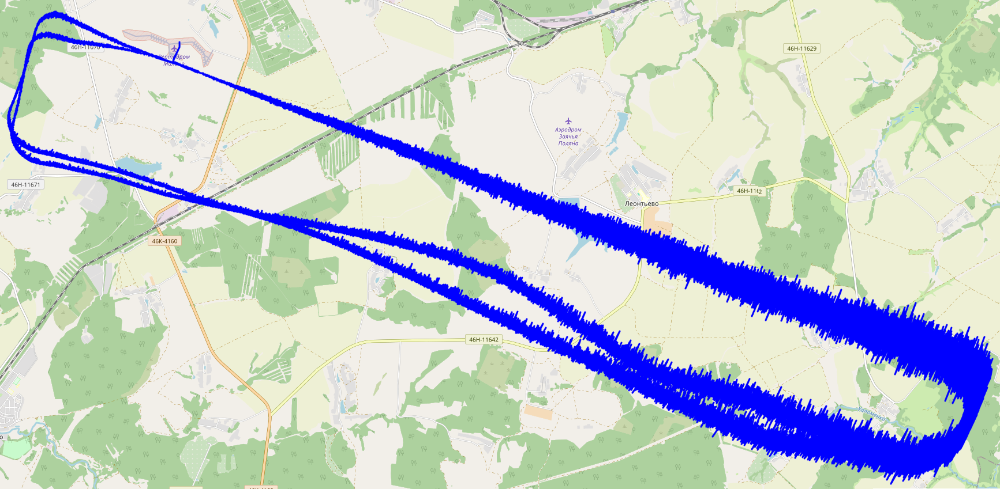

# Алгоритм БИНС и РТСЛН БПЛА

## Используемые фреймворки и библиотеки
<ul>
<li><strong>Python</strong></li>
<li><strong>Numpy</strong></li>
<li><strong>Scipy</strong></li>
<li><strong>Folium</strong></li>
<li><strong>Matplotlib</strong></li>
<li><strong>Pandas</strong></li>
<li><strong>Seaborn</strong></li>
<li><strong>Pyins</strong></li>
</ul>

## Функционал

#### 1) Алгоритм БИНС для наземного транспорта и БПЛА, вычисление ошибок ориентации, координат и скоростей

#### 2) Алгоритм РТСЛН и коррекция по РТСЛН, СНС, магнитометру, одометру, барометру

#### 3) Построение тепловой карты ошибок определения координат по маякам (математическое ожидание + )

#### 4) Построение траектории полета на реальной карте

#### 5) Перевод lan / lon (4326) в сферические координаты (3857) и обратно

#### 6) Фильтр Калмана и метод скользящего среднего